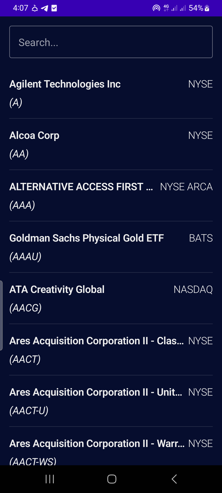
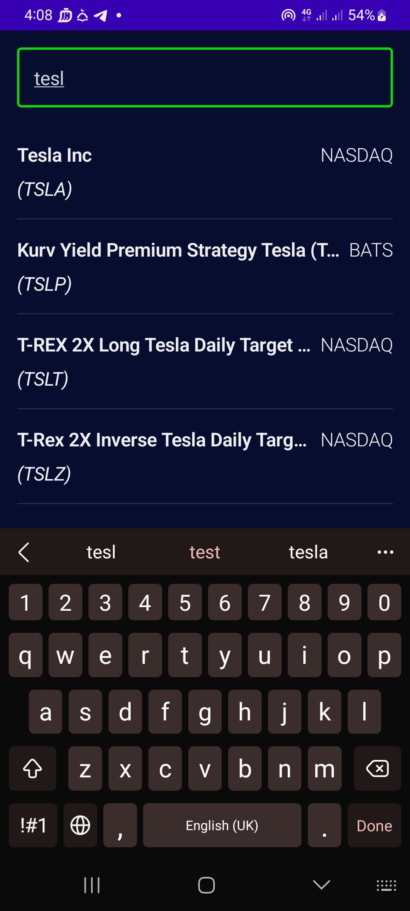

# Stock Market App

## Description
This is a stock market app developed by following a tutorial by [Philipp Lackner](https://www.youtube.com/@PhilippLackner). The app allows users to search for and view information about different stocks, including current prices, charts, and company details.

Key concepts covered in this project include:
-Jetpack Compose
- Integrating the Alpha Vantage API for stock data
- Using Kotlin Coroutines for asynchronous programming
- MVVM architecture for clean code organization
- Dependency injection with Hilt
- Room database for caching stock data

## Features
- **Search Stocks**: Users can search for stocks by company name or ticker symbol.
- **Real-time Data**: Displays the latest stock prices and percentage changes.
- **Stock Charts**: Shows historical stock data in a line chart.
- **Company Info**: Provides information about the company, including sector, description, and more.
- **Offline Access**: Cached stock data is available even when the device is offline.

<p float="left">

  &nbsp;&nbsp;&nbsp;

  &nbsp;&nbsp;&nbsp;

</p>

## Installation

To run this project on your local machine:

1. Clone the repository:
   ```bash
   git clone https://github.com/your-username/stock-market-app.git
2. Open the project in Android Studio.
3. Obtain an API key from Alpha Vantage and add it to your local.properties file as:
   alphaVantageApiKey="YOUR_API_KEY"
4. Build and run the app on an emulator or physical device.

## Usage

Once the app is running, you can:

    Search for stocks using the search bar.
    View the latest stock price, percentage change, and historical price trends.
    Tap on a stock to view detailed company information and stock charts.

## Built With

    Kotlin: The primary programming language.
    Retrofit: For network requests to the Alpha Vantage API.
    Hilt: For dependency injection.
    Room: For local caching of stock data.
    Jetpack Components: ViewModel, LiveData, Navigation, and more.

## Acknowledgments

    Huge thanks to Philipp Lackner for his comprehensive tutorial that guided the development of this app.
